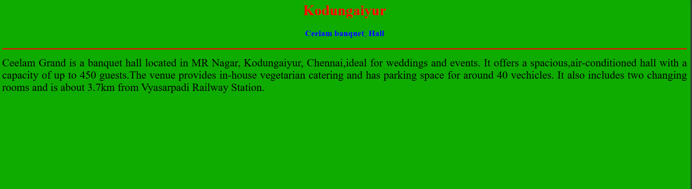
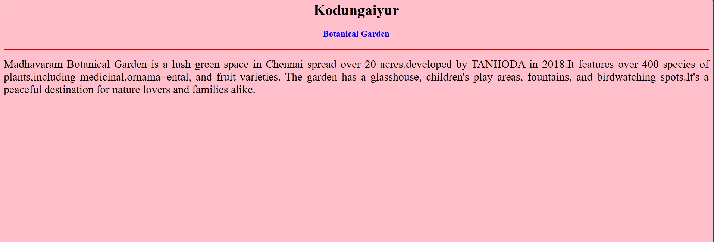
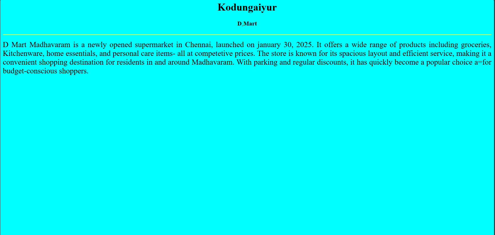
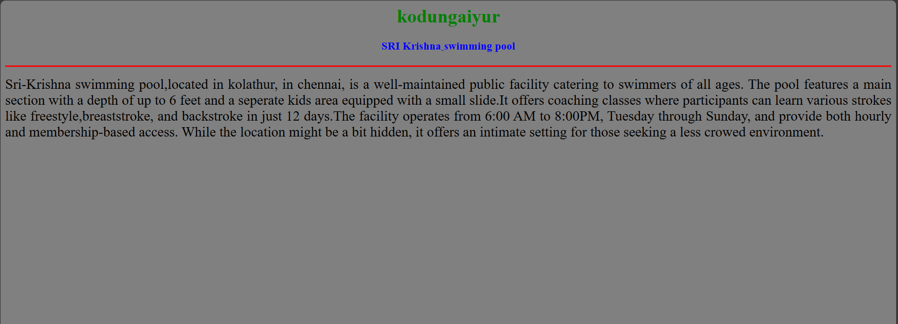
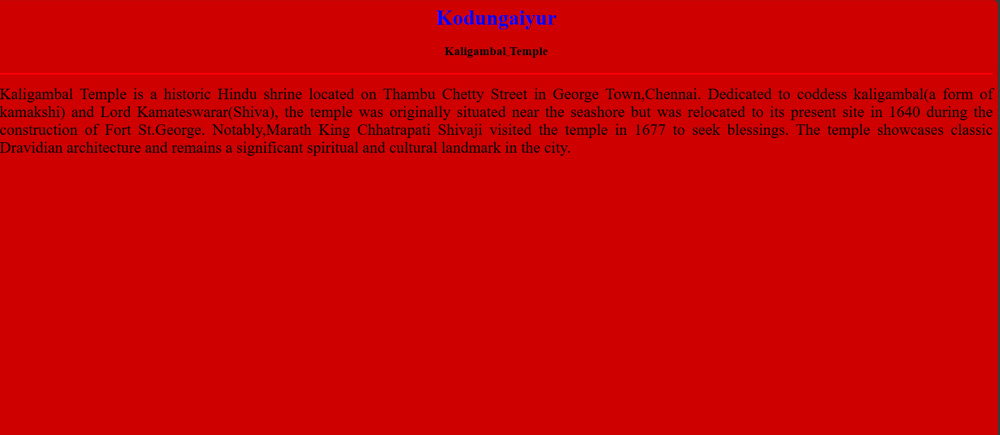

# Ex04 Places Around Me
# Date:22.04.25
# AIM
To develop a website to display details about the places around my house.

# DESIGN STEPS
## STEP 1
Create a Django admin interface.

## STEP 2
Download your city map from Google.

## STEP 3
Using <map> tag name the map.

## STEP 4
Create clickable regions in the image using <area> tag.

## STEP 5
Write HTML programs for all the regions identified.

## STEP 6
Execute the programs and publish them.

# CODE
```
map.html

<html>
<head>
    <title>My city</title>
</head>
<body>
    <h1 align="center">
    <font color="black"><b>Kodungaiyur</b></font>
    </h1>
    <h3 align="center">
    <font color="blue"><b>Sanjana J</b></font>
    </h3>
    <center>
        
        <map name="My city">
        <area shape="rect" coords="538,433,639,507" href="hall.html" title="CEELAM BANQUET HALL">
        <area shape="rect" coords="446,113,508,75" href="garden.html" title="BOTANICAL GARDEN">
        <area shape="circle" coords="1256,280,91"   href="dmart.html" title="D MART SUPERMARKET">
        <area shape="rect" coords="533,178,652,239"   href="pool.html" title="SWIMMING POOL">
        <area shap="rect"  coords="350,687,70,453"  href="temple.html" title="KALIGAMBAL TEMPLE">
        </map>
    </center>
</body>
</html>


hall.html

<html>
    <head>
        <title>My city</title>
    </head>
    <body bgcolor="peach">
    <h1 align="center">
        <font color="red"><b>Kodungaiyur</b></font>
    </h1>
      <h3 align="center">
        <font color="blue"><b>Ceelam banquet<sub>-</sub> Hall</b></font>
    </h3>
    <hr size="3" color="red">
    <p align="justify">
        <font face="avenue" size="5">
            Ceelam Grand is a banquet hall located in MR Nagar, Kodungaiyur, Chennai,ideal for weddings and events. It offers a spacious,air-conditioned hall with a capacity of up to 450 guests.The venue provides in-house vegetarian catering and has parking space for around 40 vechicles. It also includes two changing rooms and is about 3.7km from Vyasarpadi Railway Station.  
           
        </font>
    </p>
    </body>
</html>

garden.html

<html>
    <head>
        <title>My city</title>
    </head>
    <body bgcolor="pink">
    <h1 align="center">
        <font color="black"><b>Kodungaiyur</b></font>
    </h1>
      <h3 align="center">
        <font color="blue"><b>Botanical<sub>-</sub>Garden</b></font>
    </h3>
    <hr size="3" color="ceon">
    <p align="justify">
        <font face="restaurant" size="5">
            Madhavaram Botanical Garden is a lush green space in Chennai spread over 20 acres,developed by TANHODA in 2018.It features over 400 species of plants,including medicinal,ornama=ental, and fruit varieties. The garden has a glasshouse, children's play areas, fountains, and birdwatching spots.It's a peaceful destination for nature lovers and families alike.
            
        </font>
    </p>
    </body>
</html>

dmart.html

<html>
    <head>
        <title>My city</title>
    </head>
    <body bgcolor="cyan">
    <h1 align="center">
        <font color="black"><b>Kodungaiyur</b></font>
    </h1>
      <h3 align="center">
        <font color="black"><b>D<sub>-</sub>Mart</b></font>
    </h3>
    <hr size="3" color="yellow">
    <p align="justify">
        <font face="wedding venue" size="5">
            D Mart Madhavaram is a newly opened supermarket in Chennai, launched on january 30, 2025. It offers a wide range of products including groceries, Kitchenware, home essentials, and personal care items- all at competetive prices. The store is known for its spacious layout and efficient service, making it a convenient shopping destination for residents in and around Madhavaram. With parking and regular discounts, it has quickly become a popular choice a=for budget-conscious shoppers.
           
        </font>
    </p>
    </body>
</html>

pool.html

<html>
    <head>
        <title>My city</title>
    </head>
    <body bgcolor="grey">
    <h1 align="center">
        <font color="green"><b>kodungaiyur</b></font>
    </h1>
      <h3 align="center">
        <font color="blue"><b>SRI Krishna<sub>-</sub>swimming pool</b></font>
    </h3>
    <hr size="3" color="red">
    <p align="justify">
        <font face="DECATHLON" size="5">
            Sri-Krishna swimming pool,located in kolathur, in chennai, is a well-maintained public facility catering to swimmers of all ages. The pool features a main section with a depth of up to 6 feet and a seperate kids area equipped with a small slide.It offers coaching classes where participants can learn various strokes like freestyle,breaststroke, and backstroke in just 12 days.The facility operates from 6:00 AM to 8:00PM, Tuesday through Sunday, and provide both hourly and membership-based access. While the location might be a bit hidden, it offers an intimate setting for those seeking a less crowed environment.
        </font>
    </p>
    </body>
</html>

temple.html

<html>
    <head>
        <title>My city</title>
    </head>
    <body bgcolor="ceon">
    <h1 align="center">
        <font color="blue"><b>Kodungaiyur</b></font>
    </h1>
      <h3 align="center">
        <font color="black"><b>Kaligambal<sub>-</sub>Temple</b></font>
    </h3>
    <hr size="3" color="red">
    <p align="justify">
        <font face="Home" size="5">
           Kaligambal Temple is a historic Hindu shrine located on Thambu Chetty Street in George Town,Chennai. Dedicated to coddess kaligambal(a form of kamakshi) and Lord Kamateswarar(Shiva), the temple was originally situated near the seashore but was relocated to its present site in 1640 during the construction of Fort St.George. Notably,Marath King Chhatrapati Shivaji visited the temple in 1677 to seek blessings. The temple showcases classic Dravidian architecture and remains a significant spiritual and cultural landmark in the city.
        </font>
    </p>
    </body>
</html>

```
# OUTPUT







# RESULT
The program for implementing image maps using HTML is executed successfully.
